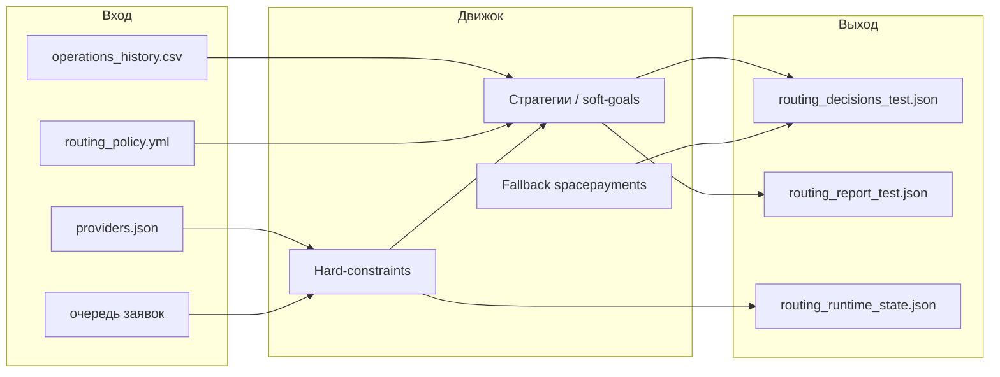
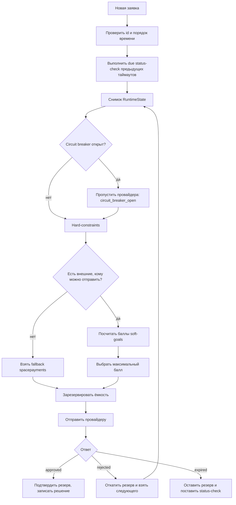
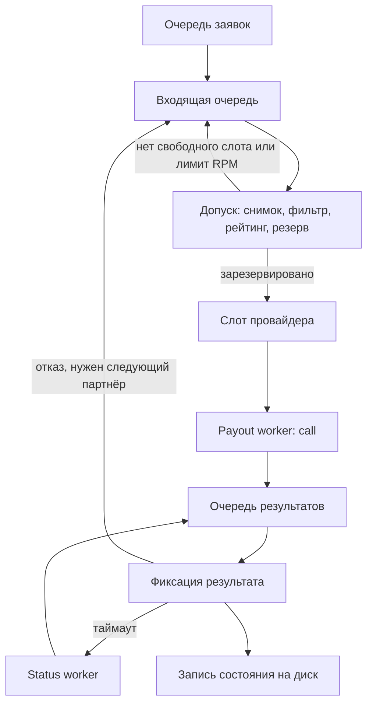

# Как устроена маршрутизация

Этот документ объясняет, **как программа обрабатывает выплату**: какие файлы она читает, какие модули участвуют и как из заявки получается решение. Формулы баллов и метрик здесь почти не разбираются — они собраны в [metrics_and_strategies.md](metrics_and_strategies.md).

Как собрать и запустить проект — в [README](../README.md).

## Задача простыми словами

Есть несколько платёжных партнёров: `vipay`, `payflow`, `quickpay` и запасной `spacepayments`. На вход приходит выплата: сумма, банк получателя, время. Нужно выбрать партнёра так, чтобы:

1. не нарушить обязательные ограничения (лимиты, банк, сумма, реквизиты и т.д.);
2. среди тех, кому заявку можно отправить, выбрать наиболее подходящего по стратегии;
3. если партнёр отказал — попробовать следующего, не нарушая те же ограничения;
4. записать, **почему** выбран именно он и почему остальные отсеяны.

`spacepayments` — это «свой» провайдер. Он не участвует в обычном рейтинге и включается только когда внешние партнёры закончились.

## Из каких частей состоит программа

| Часть                  | Роль                                                                                                                |
| ---------------------- | ------------------------------------------------------------------------------------------------------------------- |
| **CLI** (`bin/route`)  | Читает файлы, запускает движок, пишет JSON с решениями и отчётом                                                    |
| **Policy**             | Политика из `config/routing_policy.yml`: стратегии, веса, профили, fallback, параллельность                         |
| **Engine**             | Запускает маршрутизацию. По умолчанию отдаёт работу параллельному супервизору                                       |
| **Supervisor**         | Параллельный режим: одно место выбора провайдера, много одновременных ожиданий ответа                               |
| **RuntimeState**       | Живое состояние: сколько уже зарезервировано, дневной оборот, история попыток                                       |
| **Admission**          | Делает снимок состояния и спрашивает Router, кого выбрать                                                           |
| **Router**             | Сначала hard-constraints, затем soft-goals, затем выбор победителя                                                  |
| **Hard-constraints**   | Жёсткие правила «можно / нельзя». Нарушать их нельзя ни при какой стратегии                                         |
| **Soft-goals**         | Мягкие цели: каждая стратегия ставит балл от 0 до 1, профиль смешивает баллы                                        |
| **Reservation**        | Бронь ёмкости у выбранного провайдера, пока неизвестен ответ                                                        |
| **Simulator / клиент** | Имитация ответа партнёра (`approved` / `rejected` / `expired`). У реального адаптера те же методы `call` и `status` |
| **Settlement**         | Фиксирует успех, откатывает отказ или оставляет таймаут на проверку статуса                                         |
| **Status-check**       | Уточняет результат, если первый ответ был `expired`                                                                 |
| **Circuit breaker**    | Временно исключает провайдера, если слишком много неподтверждённых выплат                                           |
| **Report**             | Считает доли, отклонения, загрузку лимитов и формулирует рекомендации                                               |

Настройки стратегий меняются в YAML, без правки ядра. Новые правила и провайдеры подключаются отдельно от выбора победителя: сначала фильтр, потом рейтинг, потом исполнение.

## Вход и выход



CLI только собирает эти части вместе. Сама очередь JSON — это адаптер «проиграть заявки». В текущей политике включён параллельный режим: несколько выплат могут ждать ответ провайдера одновременно. Выбор партнёра и бронь ёмкости при этом остаются последовательными, чтобы две заявки не заняли одно и то же место.

Как устроена параллельность — в разделе [Параллельная обработка](#параллельная-обработка). Ниже — логика **одной** выплаты. Она одинакова и в параллельном, и в последовательном режиме.

## Поток одной заявки

Так программа принимает решение по одной выплате. Ниже тот же путь разобран на реальной заявке `op_101`.



### 1. Загрузка данных

CLI читает каталог провайдеров, историю и очередь. История нужна, чтобы оценить конверсию по прошлым попыткам. Она **не** смешивается с количеством заявок текущей очереди: в отчёте история показывается отдельно как `history_baseline`.

Политика задаёт:

- fallback: `spacepayments`;
- профили провайдеров: у `vipay` — `reliable_history`, у `payflow` — `controlled_share`, у `quickpay` — `capacity_obligation`;
- включённые стратегии и их веса;
- как часто проверять зависшие выплаты и когда открывать circuit breaker.

### 2. Снимок и жёсткий фильтр

Перед выбором `RuntimeState` делает снимок: текущие лимиты, резервы, обороты, свежие метрики. По этому снимку `HardConstraints::Filter` проверяет каждого **внешнего** провайдера:

| Проверка          | Когда провайдер отсекается                                       |
| ----------------- | ---------------------------------------------------------------- |
| Статус            | не `active`                                                      |
| Сумма             | вне `limit_amount_min` / `limit_amount_max`                      |
| Дневной лимит     | оборот + сумма заявки больше `daily_amount_limit`                |
| Операции в работе | превышен лимит числа или суммы «в полёте»                        |
| Банк              | банка нет в списке (или он в списке исключений)                  |
| Маржа             | комиссия провайдера выше маржи мерчанта, и нет согласия на минус |
| Реквизиты         | свободных реквизитов нет                                         |
| Интенсивность     | уже исчерпан лимит запросов в минуту                             |

Fallback в этот рейтинг не попадает. Он рассматривается отдельно и только если внешний пул пуст.

Если правило не выполнено, в `attempts` пишется `skipped` с конкретной причиной, например `amount_exceeds_limit` или `bank_not_in_list`. Стратегия это не «переспорить» не может.

### 3. Мягкий рейтинг

Оставшиеся кандидаты получают баллы. Каждая стратегия смотрит на свои метрики и возвращает число от 0 до 1. Профиль провайдера задаёт веса. Итоговый балл — взвешенная сумма. Побеждает максимальный балл; при равенстве сначала меньший `priority`, затем имя.

Как именно считаются баллы — в [metrics_and_strategies.md](metrics_and_strategies.md). Здесь важно только:

- это предпочтение, а не запрет;
- проигравшие допустимые провайдеры попадают в `attempts` как `lower_soft_score`;
- если стратегии спорят (конверсия тянет к одному, свободная ёмкость — к другому), спор записывается в `details` выбранной попытки.

### 4. Резерв, отправка, ответ

Выбранного провайдера резервируют **атомарно** против того же снимка: лимиты проверяются ещё раз, чтобы параллельная заявка не заняла то же место. Если снимок уже устарел, выбор повторяется.

Дальше вызывается клиент провайдера. В этом репозитории это симулятор:

- с вероятностью около `conversion_24h` приходит `approved`;
- иначе поровну `rejected` или `expired`;
- задержка берётся из `avg_latency_sec`.

Поведение после ответа:

| Результат              | Что делает система                                                                                       |
| ---------------------- | -------------------------------------------------------------------------------------------------------- |
| `approved`             | Резерв становится подтверждённым оборотом. Решение финальное                                             |
| `rejected`             | Резерв откатывается. Провайдер исключается для этой заявки, выбирается следующий                         |
| `expired`              | Резерв **остаётся**. Сразу следующего партнёра не берём: выплата могла уже пройти. Ставится status-check |
| Ошибка «точно не ушло» | Резерв снимается, провайдер временно исключается, пробуем дальше                                         |
| Неясная ошибка сети    | Как таймаут: резерв держим, уточняем статус                                                              |

Ключ идемпотентности попытки: `<operation_id>:<provider>`. Повторно отправить ту же выплату тому же партнёру с другим ключом система не должна.

### 5. Status-check и circuit breaker

Если первый ответ — таймаут, `StatusCheckRunner` спрашивает статус с задержками из политики (5, 15, 30, 60 секунд, до 5 попыток). Runner двигает логические часы и в конце очереди обязательно обрабатывает висящие проверки (`drain`). Поэтому таймаут на последней заявке тоже будет разобран.

Когда лимит попыток исчерпан, задача переходит в `reconciliation_pending`. Резерв не отпускается: неизвестный результат нельзя считать отказом и нельзя из‑за него запускать второго провайдера.

Если у провайдера слишком много неподтверждённых выплат (по числу или сумме), circuit breaker открывается. Новые заявки к нему не идут, причина в решении — `circuit_breaker_open`.

После успеха, отказа или таймаута состояние провайдера обновляется: оборот, операции в работе, RPM, метрики истории. Следующая заявка уже видит новую картину.

## Живой пример: выплата `op_101`

Возьмём первую заявку из `data/operations_queue_10.json`.

```json
{
  "operation_id": "op_101",
  "created_at": "2026-07-30T09:05:00+03:00",
  "amount": 15000,
  "bank": "sberbank"
}
```

Это 15 000 ₽ в Сбербанк.

### Шаг 1. Кто вообще может принять заявку

Смотрим обязательные ограничения по `data/providers.json`.

| Провайдер       | Сумма 15 000          | Банк `sberbank`                  | Остальное                                    | Итог                          |
| --------------- | --------------------- | -------------------------------- | -------------------------------------------- | ----------------------------- |
| `vipay`         | можно (1 000…100 000) | есть в списке                    | активен, есть реквизиты, лимиты не исчерпаны | проходит                      |
| `payflow`       | можно (500…50 000)    | есть в списке                    | то же                                        | проходит                      |
| `quickpay`      | можно (1 000…200 000) | список банков пустой = все банки | то же                                        | проходит                      |
| `spacepayments` | запасной              | не участвует в рейтинге          | —                                            | ждёт, если внешние закончатся |

Жёстких отказов нет. Все трое внешних попадают в рейтинг.

### Шаг 2. Кому отдать предпочтение

У каждого свой профиль и свои веса. Система считает пять стратегий (каскад и диапазон суммы в основных профилях выключены) и складывает баллы.

На старте очереди получается такая картина (округлённо, как в реальном прогоне):

| Стратегия                | vipay      | payflow    | quickpay   |
| ------------------------ | ---------- | ---------- | ---------- |
| Конверсия                | 0.8955     | 0.8067     | 0.6531     |
| Доля по числу заявок     | 0.7275     | 0.6775     | 0.5775     |
| Доля по объёму           | 0.9672     | 0.9667     | 0.9674     |
| Запас ресурсов           | 0.3570     | 0.0283     | 0.8606     |
| Оборот по обязательствам | 0.5000     | 0.5000     | 0.7770     |
| **Итоговый балл**        | **0.8170** | **0.7780** | **0.7088** |

Побеждает `vipay`. Не потому что он лучше по всем пунктам: у `quickpay` больше свободной ёмкости и сильнее бонус за недобор оборота. Но у `vipay` выше оценка успеха, а в профиле `reliable_history` конверсия весит 75%. Этого хватает.

Как посчитан каждый столбец — в [metrics_and_strategies.md](metrics_and_strategies.md), там тот же пример с формулами.

### Шаг 3. Резерв и ответ

Движок бронирует 15 000 ₽ у `vipay` (счётчик «в работе», дневной оборот, RPM). Симулятор по `conversion_24h = 0.87` и seed из политики отвечает `approved` с задержкой 38 секунд. Резерв подтверждается.

В `routing_decisions_test.json` для этой заявки будет примерно так:

- `payflow` и `quickpay` — `skipped`, причина `lower_soft_score`, в `details` сравнение баллов;
- `vipay` — `selected`, причина `highest_soft_score`;
- в `details` выбранного: профиль, итоговый балл, оценка конверсии, вклад каждой стратегии, и пометки, что стратегии спорили друг с другом.

Споры не ломают выбор. Они объясняют жюри: «конверсия хотела vipay, а свободная ёмкость — quickpay; победил взвешенный балл».

### Шаг 4. Что видит следующая заявка

`op_102` приходит уже в обновлённое состояние: у `vipay` на одну подтверждённую выплату больше. История конверсии тоже пополнилась этой попыткой.

У `op_102` банк `alfa`. `vipay` сразу отсекается жёстким правилом `bank_not_in_list`. Дальше спорят только `payflow` и `quickpay`. Выигрывает `payflow`.

Так hard-constraints и soft-goals разделены: банк — это «нельзя», а не «чуть хуже балл».

## Другие типичные развилки на той же очереди

**Только один допустимый.** `op_103` на 150 000 ₽: и `vipay`, и `payflow` не принимают такую сумму. Остаётся `quickpay`, причина выбора — `only_eligible_provider`. Рейтинг всё равно считается (для отчёта), но конкурировать не с кем.

**Сумма ниже минимума.** `op_107` на 800 ₽ проходит только у `payflow` (`limit_amount_min` у остальных — 1 000).

**Отказ после выбора.** Если бы симулятор вернул `rejected`, резерв сняли бы, `vipay` пометили бы как испробованного, и для той же заявки заново сняли бы снимок. `payflow` и `quickpay` снова прошли бы фильтр, и победил бы уже другой балл.

**Таймаут.** Резерв остаётся. В решении `simulated_result` сначала `expired`. Позже status-check может сменить его на `approved` или `rejected`. Пока статус неизвестен, второго провайдера нет: иначе можно заплатить дважды.

**Все внешние недоступны.** Тогда выбирается `spacepayments`, причина `fallback_selected`.

## Как это связано с отчётом

После очереди `Report` смотрит уже принятые решения и текущее состояние провайдеров. Он считает:

- фактическую долю заявок и отклонение от `traffic_percentage`;
- успехи, отказы, таймауты;
- загрузку дневного лимита;
- причины `skipped`;
- рекомендации вида «у провайдера X загрузка 80%+ — уменьшите `traffic_percentage`».

История в эти доли текущей очереди не входит. Прогноз конверсии в отчёте отдельно сравнивается с опубликованным KPI (Brier score) — это диагностика качества оценки, а не доказательство, что маршрутизация «лучше рынка».

## Параллельная обработка

По умолчанию (`concurrency.enabled: true` в `config/routing_policy.yml`) движок запускает `Concurrency::Supervisor`. Правила выбора провайдера те же, что описаны выше. Меняется только **когда** система ждёт ответ: ожидание одной выплаты больше не останавливает остальные.

Простой смысл. Симулятор `vipay` отвечает с задержкой 38 секунд. В последовательном режиме `op_102` стояла бы эти 38 секунд в очереди. В параллельном режиме система уже успевает выбрать партнёра для следующих заявок и отправить их, пока `op_101` ещё ждёт `approved`.

Чтобы две выплаты не нарушили лимит, параллелится только обмен с провайдером. Решение «кому отдать заявку» и бронь ёмкости идут в одном потоке допуска.

### Что параллелится, а что нет

| Делается по одной                                   | Делается сразу несколькими                                                |
| --------------------------------------------------- | ------------------------------------------------------------------------- |
| Снимок состояния, hard-constraints, рейтинг, резерв | Ожидание ответа `call` у провайдера                                       |
| Применение результата (успех / отказ / таймаут)     | Ожидание status-check                                                     |
| Запись решения в память движка                      | Запись `routing_runtime_state.json` на диск (отдельным потоком, с паузой) |

Пока резерв не поставлен, заявка ещё не поступила к партнёру. Поэтому допуск нельзя запускать вслепую параллельно, иначе две заявки могли бы обе его занять.

### Как устроен супервизор



Три цикла работают рядом:

1. **Допуск** забирает заявку из входящей очереди, выбирает провайдера, бронирует ёмкость и отдаёт вызов в слот этого провайдера.
2. **Фиксация** забирает ответы (`approved` / `rejected` / `expired` или ошибка сети) и меняет состояние.
3. **Status-check** в свой срок уточняет таймауты, не дожидаясь следующей заявки из файла.

Обработчики выплат и status-check только вызывают внешний API (в кейсе — симулятор) и кладут результат в очередь. Они **не** выбирают провайдера и **не** двигают счётчики сами.

### Слоты: сколько запросов можно держать активными

У каждого провайдера свой пул обработчиков. Размер слота:

- по умолчанию это `in_progress_count_limit` партнёра (сколько одновременных выплат он сам готов держать);
- если у провайдера такого лимита нет, берётся `fallback_worker_limit` (сейчас 4 — так у `spacepayments`);
- если в YAML задан `max_workers_per_provider`, берётся меньшее из двух чисел.

Для публичного каталога это примерно: `vipay` до 10 одновременных вызовов, `payflow` до 8, `quickpay` до 15.

Если слот выбранного провайдера занят, его не резервируют «в долг». В `attempts` пишется `no_dispatch_slot`, партнёр временно исключается, и допуск сразу пробует следующего, кто прошёл hard-constraints. Это не отказ партнёра и не нарушение лимита: просто сейчас нет свободного обработчика.

### Снимок и повтор выбора

Перед выбором `RuntimeState` снимает снимок с номером версии. Резерв принимается, только если версия не успела измениться. Если другая выплата уже забронировала ёмкость, снимок считается устаревшим: заявка остаётся во входящей очереди и выбирает партнёра заново по свежим цифрам.

Жёсткие правила проверяются дважды: на снимке и ещё раз внутри резерва. Поэтому параллельность не отменяет лимиты дня, «в полёте», RPM и остальные hard-constraints.

### Если сейчас отправить некуда, но место должно освободиться

Иногда все подходящие партнёры временно заняты: исчерпан RPM, нет свободного слота, или ёмкость в процессе забита, но по ним ещё ждут ответ или status-check. Тогда заявку **нельзя** отправить на fallback и нельзя отбросить.

Допуск ставит её обратно в **голову** входящей очереди и ждёт сигнал: кто-то ответил, слот освободился, или подошло окно RPM. Как только ёмкость могла измениться, выбор повторяется. Fallback `spacepayments` по-прежнему включается только когда внешних вариантов действительно нет, а не когда они просто заняты на секунду.

### Что происходит с ответом

Обработчик выплаты вызывает клиента и кладёт событие в очередь фиксации.

| Ответ                             | Что дальше в параллельном режиме                                                       |
| --------------------------------- | -------------------------------------------------------------------------------------- |
| `approved`                        | Резерв подтверждается, решение сохраняется, слот освобождается                         |
| `rejected`                        | Резерв снимается, та же заявка возвращается во входящую очередь уже без этого партнёра |
| `expired` или неясная ошибка сети | Резерв остаётся, слот освобождается, ставится status-check                             |
| Status-check `approved`           | Решение становится финальным                                                           |
| Status-check `rejected`           | Заявка снова входит в допуск, чтобы взять следующего партнёра                          |

Пока по выплате висит таймаут, второго провайдера нет: иначе можно заплатить дважды. Это то же правило, что и в последовательном режиме.

Status-check работает с собственным пулом (по умолчанию до 8 одновременных проверок) и отслеживает время. В конце прогона супервизор не заканчивает работу, пока есть незавершённые выплаты, активные вызовы, непросмотренные результаты или активные status-check. Если после этого решение так и не стало финальным (`reconciliation_pending`), программа сообщает об ошибке: для сдачи кейса все заявки очереди должны получить итог.

### Запись состояния на диск

Каждая фиксация результата ставит в очередь сохранение `routing_runtime_state.json`. Пишет отдельный поток, с паузой `persist_debounce_ms` (сейчас 50 мс), чтобы не тормозить выбор из‑за диска. Это снимок для анализа, а не восстановление после рестарта.

### Настройки и как выключить

Блок в `config/routing_policy.yml`:

```yaml
concurrency:
  enabled: true
  executor: fiber_pool
  fallback_worker_limit: 4
  max_workers_per_provider: null
  status_worker_limit: 8
  persist_debounce_ms: 50
  event_log: false
```

| Поле                       | Что значит                                                                                               |
| -------------------------- | -------------------------------------------------------------------------------------------------------- |
| `enabled`                  | Включён ли параллельный супервизор. Сейчас `true`, поэтому обычный `ruby bin/route` уже идёт параллельно |
| `executor`                 | `fiber_pool` — лёгкие задачи Async, пока ждут сеть; `thread_pool` — обычные потоки ОС                    |
| `fallback_worker_limit`    | Сколько одновременных вызовов, если у провайдера нет `in_progress_count_limit`                           |
| `max_workers_per_provider` | Дополнительный потолок на партнёра. `null` — только лимит провайдера                                     |
| `status_worker_limit`      | Сколько status-check можно выполнять сразу                                                               |
| `persist_debounce_ms`      | Пауза перед записью состояния на диск                                                                    |
| `event_log`                | Если `true`, рядом пишется журнал сохранений `.jsonl`                                                    |

Последовательный режим (заявка за заявкой, как в разделе «Поток одной заявки», без перекрытия ожидания) включается так:

```yaml
concurrency:
  enabled: false
```

Флаг `ruby bin/route --concurrent` принудительно включает параллельность, даже если в YAML стоит `false`.
